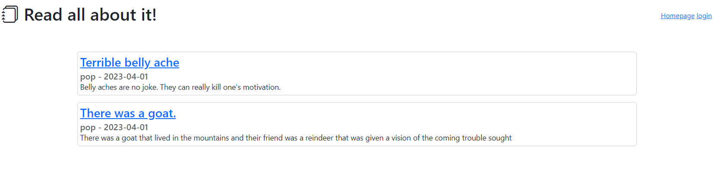
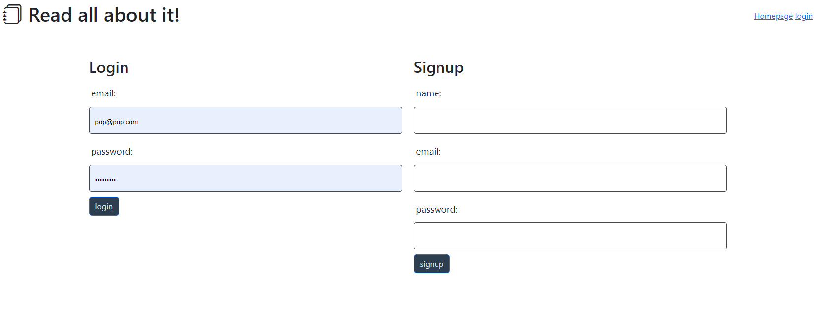
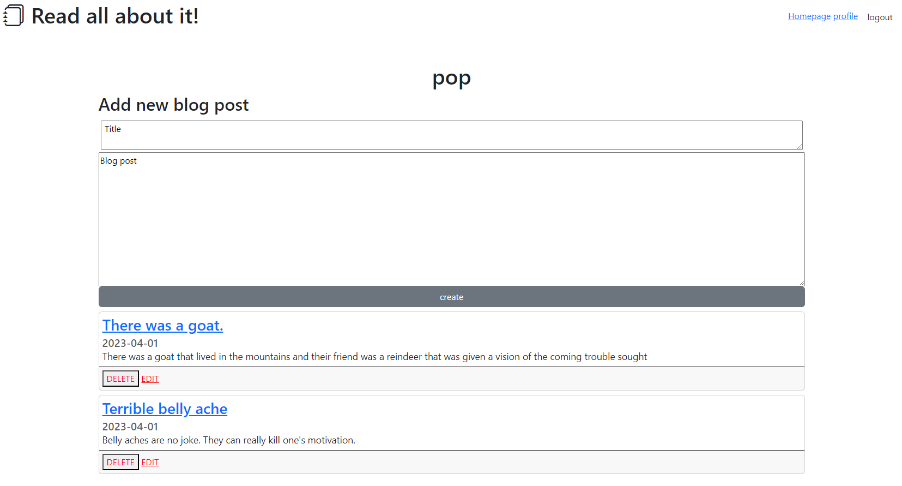

# Glob-Blog
Tech blog from scratch

## Description

This is a simple blog website that allows for comments and the ability to edit a post. It has functionality for multiple users to sign up and create posts and even comment on other's posts. The main page is a listing of the blog posts that have been posted. The profile page allos for the signed in user to create, delete, or edit thier published posts.

## Usage

This website has the typical point and click interface. There are links and buttons to follow to navigate from teh home page and profile.

## License

MIT

## Screen Shots

